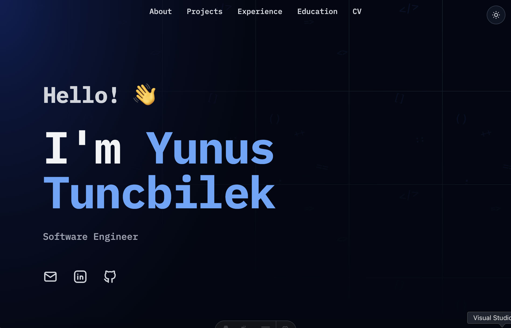

# Yunus Tuncbilek — Portfolio

This is the source for my personal portfolio site, showcasing my background, projects, experience, and education. Supports light/dark mode, matching the visitor's system preference.

## Built With

- **[Astro](https://astro.build/)** - Static site generator for modern web apps
- **[Tailwind CSS v4](https://tailwindcss.com/)** - Utility-first CSS framework
- **[Tabler Icons](https://tabler.io/icons)** - Free and open source icons
- **TypeScript** - For type-safe configuration

All personal content (name, bio, skills, projects, experience, education, and social links) lives in a single file: `src/config.ts`.

## Deployment

This site deploys automatically to GitHub Pages via the GitHub Actions workflow included in the badge at the top.

## License

This project is MIT licensed. See LICENSE.md.

---

Built on top of the [DevPortfolio](https://github.com/RyanFitzgerald/devportfolio) template by [Ryan Fitzgerald](https://github.com/RyanFitzgerald). Many thanks to him for the original design and structure this site is based on.
